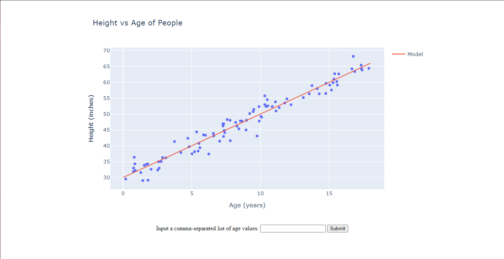
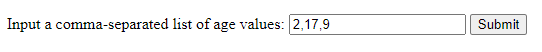
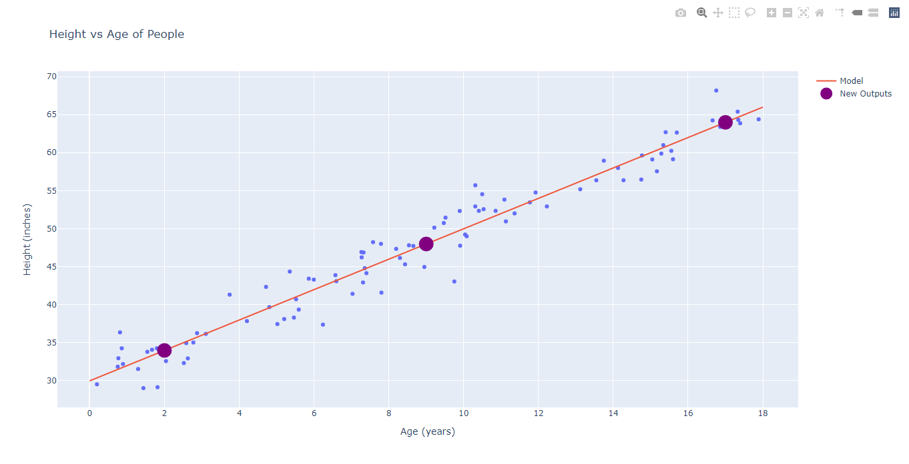

<h1> Age Prediction App</h1>
<h3>Created Using Sklearn Linear regression and Plotly</h3>

<h1>Visit our website at:<h1>

[AgeToHeight Predictor](https://agepredictor.herokuapp.com/)

<h1> Screenshots:</h1>

<h1> How to use it locally:</h1>
<ul>
<li>Clone the project locally</li>
<li>Run the <b>./venv/bin/activate</b> command</li>
<li>Once that is done run the <b>py 'app.py'</b> command to run the project.</li>
<li><b>Wallah the project is running!</b></li>
</ul>
